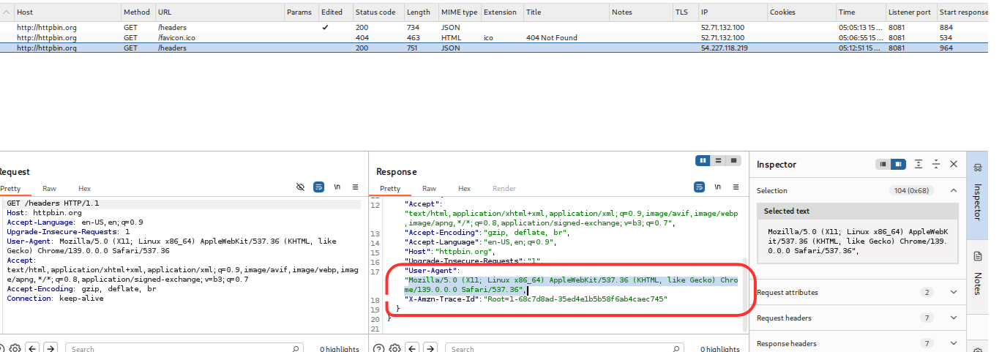
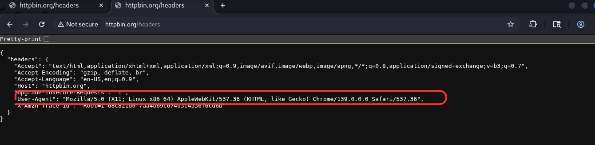
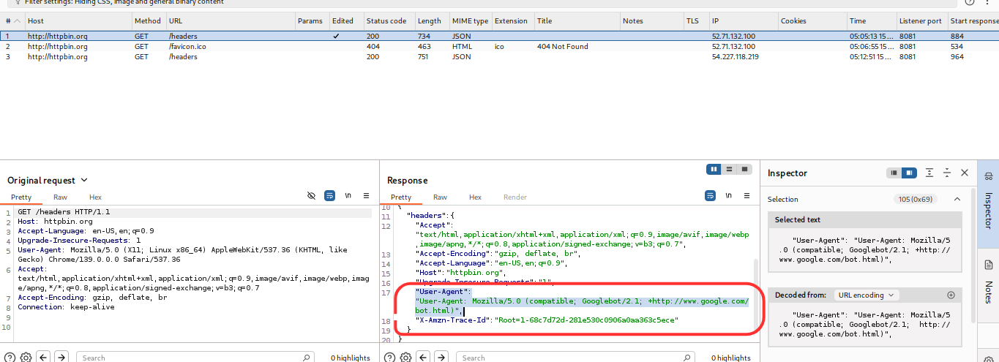
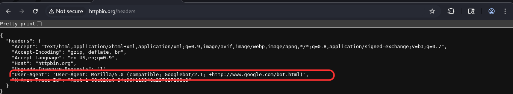

# Manipulación de `User-Agent` con Burp Suite

Este repositorio contiene una **breve guía** y recursos para entender y probar la manipulación de la cabecera `User-Agent` en peticiones HTTP usando **Burp Suite**.  
La intención es educativa y orientada a pruebas defensivas / pentesting.

---

## ¿Qué es `User-Agent`?
`User-Agent` es una **cabecera HTTP** que identifica el cliente que hace la petición (navegador, versión, sistema operativo o bot).  
Los servidores pueden adaptar contenido o comportamiento en función del `User-Agent`.

---

## ¿Por qué importa en ciberseguridad?
- Evaluar si la aplicación muestra contenido distinto según el agente.  
- Detectar rutas o comportamientos accesibles sólo para ciertos agentes (p. ej. bots).  
- Probar evasión de filtros o WAFs que filtran por `User-Agent`.  
- Reproducir/analizar condiciones específicas de clientes para pruebas (móvil, navegadores antiguos, crawlers).

---

## Cómo reproducir la demo (resumen rápido)

> Recomendado: Kali Linux + Burp Suite + navegador (Firefox/Chromium)

1. **Iniciar Burp Suite**
   - `Applications → Web → Burp Suite` → Temporary Project → Start Burp.

2. **Configurar proxy del navegador**
   - Proxy manual: `127.0.0.1` puerto `8080` (Burp escucha ahí por defecto).  
   - (Opcional) Importar el certificado CA de Burp para HTTPS si interceptas `https:`.

3. **Interceptar petición**
   - En Burp: `Proxy → Intercept → Intercept is on`.  
   - En el navegador, visita: [`https://httpbin.org/headers`](https://httpbin.org/headers).  
   - La petición debería detenerse en Burp.

4. **Modificar `User-Agent`**
   - En la petición interceptada, edita la línea:
     ```http
     User-Agent: <cadena deseada>
     ```
   - Ejemplo (simular Googlebot):
     ```http
     Mozilla/5.0 (compatible; Googlebot/2.1; +http://www.google.com/bot.html)
     ```

5. **Enviar la petición**
   - En Burp: `Forward` (o usar `Repeater`) y observa la respuesta JSON en el navegador o en `httpbin.org`, que mostrará las cabeceras recibidas.

---

## URLs y recursos útiles
- **Referencia oficial (MDN):** [User-Agent](https://developer.mozilla.org/en-US/docs/Web/HTTP/Headers/User-Agent)  
- **Colección de User-Agents:** [useragentstring.com](https://www.useragentstring.com/)  
- **Lista de User-Agents en GitHub:** [tamimibrahim17/List-of-user-agents](https://github.com/tamimibrahim17/List-of-user-agents)  
- **Servicio de prueba (HTTPBin):** [httpbin.org/headers](https://httpbin.org/headers)

---

## Ejemplos de `User-Agent` útiles
- **Chrome (Windows):**
```http
Mozilla/5.0 (Windows NT 10.0; Win64; x64) AppleWebKit/537.36 (KHTML, like Gecko) Chrome/118.0.5993.90 Safari/537.36

Googlebot:
Mozilla/5.0 (compatible; Googlebot/2.1; +http://www.google.com/bot.html)

```
---








